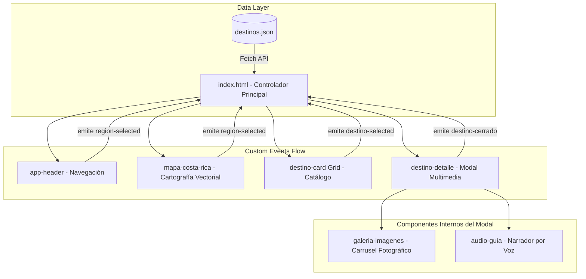

# Guía Turística Multimedia de Costa Rica • Pura Vida

Bienvenido a la **Guía Turística Multimedia de Costa Rica**, una aplicación web interactiva de alto impacto visual y sonoro diseñada para explorar la riqueza natural, cultural y recreativa de las distintas regiones del país. La plataforma ofrece una experiencia inmersiva mediante el uso de tecnologías web nativas, integrando recursos fotográficos, cartografía vectorial interactiva por cantones, reproductores multimedia y síntesis de voz dinámica.

---

## 📋 Descripción General del Proyecto

Esta plataforma es una aplicación web interactiva basada en **Web Components nativos** (sin dependencias de frameworks externos como React, Vue o Angular), desarrollada para funcionar íntegramente en el navegador. La aplicación organiza los destinos turísticos costarricenses en cuatro regiones principales: **Guanacaste (Pacífico Norte)**, **Caribe**, **Valle Central** y **Pacífico Sur (Pacífico Central y Sur)**.

Cada región cuenta con un tema de diseño visual específico y adaptativo. Los usuarios pueden explorar destinos turísticos representativos, consultar sus detalles en una ventana modal interactiva, navegar por galerías fotográficas, escuchar descripciones narradas de viva voz y acceder a videos informativos.

---

## 🎯 Objetivo General y Específicos

### Objetivo General
Desarrollar una aplicación web multimedia interactiva para explorar los destinos turísticos de Costa Rica, implementada íntegramente con Web Components nativos, sin frameworks externos, e integrando datos estructurados en JSON, audio y video.

### Objetivos Específicos
* **Diseño e Interfaz**: Aplicar principios de diseño de interfaces, usabilidad y accesibilidad (`prefers-reduced-motion`) en la construcción de una experiencia de usuario coherente, fluida y visualmente atractiva ("Pura Vida").
* **Integración Multimedia**: Integrar recursos multimedia (imágenes, audio-guía y video) de forma orgánica en la interfaz.
* **Gestión de Datos**: Administrar los datos de los destinos turísticos mediante archivos JSON cargados dinámicamente (`fetch`).
* **Arquitectura Modular**: Construir la aplicación utilizando componentes reutilizables autocontenidos (Shadow DOM) y comunicación desacoplada mediante Custom Events.

---

## 🌟 Funcionalidades y Características Principales

✔ **Mapa Turístico Real de Costa Rica**: Mapa vectorial interactivo construido con la cartografía oficial de los 265 cantones de Costa Rica, agrupados por regiones con efectos ambientales de luz fluida.  
✔ **Navegación e Interacción Instantánea**: Selección de regiones desde el header o el mapa interactivo con respuesta inmediata (0ms de lag de re-renderizado).  
✔ **Modo Oscuro Tropical Nocturno**: Selector de tema Claro (Arena & Selva) y Oscuro (Noche Tropical) con persistencia en `localStorage`.  
✔ **Fondo Mágico Animado por Scroll**: Canvas dinámico de orbes luminosos que mutan de forma y se desplazan en paralaje 3D conforme el usuario navega.  
✔ **Galería de Imágenes Interactivas**: Carrusel fotográfico con controles de navegación anterior/siguiente e indicadores visuales.  
✔ **Audio-Guía Narrada**: Reproductor de audio nativo y sintetizador por voz para escuchar la descripción de cada destino.  
✔ **Diseño 100% Responsivo y Accesible**: Adaptación fluida a móviles, tabletas y computadoras de escritorio.  

---

## 🛠️ Tecnologías Utilizadas

La aplicación ha sido desarrollada utilizando estrictamente los estándares web modernos exigidos por el curso:

| Tecnología | Descripción y Uso en el Proyecto |
| :--- | :--- |
| **HTML5** | Estructuración semántica y contenedores para Custom Elements. |
| **CSS3 (Custom Properties)** | Tokens de diseño, transiciones hardware, animaciones de paralaje y media queries responsivas. |
| **JavaScript (ES6+)** | Lógica de negocio, consumo asíncrono (`Fetch API`) y módulos nativos (`ES Modules`). |
| **Web Components API** | Creación de componentes personalizados reutilizables mediante `customElements.define`. |
| **Shadow DOM v1** | Encapsulación completa en modo `open` para aislar estilos CSS y marcado HTML. |
| **Custom Events API** | Comunicación desacoplada entre componentes y la aplicación (`region-selected`, `destino-selected`, `destino-cerrado`). |
| **APIs Multimedia Nativas** | Integración de `<audio>`, `<video>` y la API Web Speech (`speechSynthesis`) para audio-guías. |

---

## 🏗️ Arquitectura del Proyecto y Flujo de Datos

El proyecto implementa una arquitectura desacoplada coordinada por un controlador central en `index.html`. La comunicación entre componentes utiliza **Custom Events** (con `bubbles: true, composed: true`) y la actualización de **Atributos Observados** (`observedAttributes`).



---

## 📂 Estructura Completa de Archivos

Estructura de archivos conforme a las especificaciones del proyecto:

```text
GuiaTuristica/
├── index.html                  # Controlador principal de la aplicación y maquetación general
├── CREDITOS.md                 # Atribuciones de imágenes, audios y fuentes utilizadas
├── README.md                   # Documentación técnica del proyecto
├── assets/                     # Recursos estáticos
│   ├── audio/                  # Archivos de audio locales
│   ├── img/                    # Fotografías de los destinos turísticos
│   └── cantones_real.svg       # Cartografía vectorial oficial de Costa Rica
├── components/                 # Definición de Custom Elements (Shadow DOM)
│   ├── app-header.js           # Header de navegación, selector de tema y regiones
│   ├── mapa-costa-rica.js      # Mapa interactivo de 265 cantones por región
│   ├── destino-card.js         # Tarjeta de vista previa en el catálogo
│   ├── destino-detalle.js      # Modal contenedor de información y recursos multimedia
│   ├── galeria-imagenes.js     # Carrusel fotográfico con controles
│   └── audio-guia.js           # Reproductor de audio y sintetizador por voz
├── css/                        # Estilos globales y tokens del sistema de diseño
│   └── global.css              # Reset, fuentes, fondo mágico por scroll y variables CSS
└── data/                       # Almacenamiento estructurado
    └── destinos.json           # Base de datos JSON con la información de los destinos
```

---

## 🧩 Explicación de los Custom Elements

La aplicación se compone de **6 Custom Elements** nativos autocontenidos:

### 1. `<app-header>` ([components/app-header.js](file:///c:/projects/MultimediosFinal/GuiaTuristica/components/app-header.js))
* **Propósito**: Barra de navegación superior con el distintivo "Costa Rica Pura Vida", menú de selección regional y botón para conmutar el Modo Oscuro / Claro.
* **Atributos Observados**: `active-region`.
* **Eventos Emitidos**: `region-selected`.

### 2. `<mapa-costa-rica>` ([components/mapa-costa-rica.js](file:///c:/projects/MultimediosFinal/GuiaTuristica/components/mapa-costa-rica.js))
* **Propósito**: Renderizado interactivo del mapa vectorial real de Costa Rica agrupando 265 vectores de cantones en las 4 regiones turísticas del proyecto. Cuenta con orbes de luz ambiental de fondo que cambian dinámicamente según la región seleccionada.
* **Atributos Observados**: `active-region`.
* **Eventos Emitidos**: `region-selected`.

### 3. `<destino-card>` ([components/destino-card.js](file:///c:/projects/MultimediosFinal/GuiaTuristica/components/destino-card.js))
* **Propósito**: Tarjeta de presentación de un destino en el catálogo con imagen de portada, badge regional, título y micro-interacciones al pasar el cursor.
* **Atributos Observados**: `destino-id`, `nombre`, `region`, `imagen`.
* **Eventos Emitidos**: `destino-selected`.

### 4. `<destino-detalle>` ([components/destino-detalle.js](file:///c:/projects/MultimediosFinal/GuiaTuristica/components/destino-detalle.js))
* **Propósito**: Ventana modal interactiva que muestra el desglose del destino: descripción, badges de actividades, coordenadas geográficas, botón de video y contenedor para la galería y audio-guía.
* **Atributos Observados**: `destino-id`, `visible`, `region`.
* **Eventos Emitidos**: `destino-cerrado`.

### 5. `<galeria-imagenes>` ([components/galeria-imagenes.js](file:///c:/projects/MultimediosFinal/GuiaTuristica/components/galeria-imagenes.js))
* **Propósito**: Carrusel de fotos dentro del modal con botones de navegación (anterior/siguiente), puntos indicadores e integración accesible.
* **Atributos Observados**: `imagenes` (JSON array), `titulo`.

### 6. `<audio-guia>` ([components/audio-guia.js](file:///c:/projects/MultimediosFinal/GuiaTuristica/components/audio-guia.js))
* **Propósito**: Reproductor de audio que utiliza el elemento nativo `<audio>` y la API SpeechSynthesis para la narración por voz en tiempo real de los destinos.
* **Atributos Observados**: `src`, `texto`, `titulo`, `descripcion`, `region`.

---

## 🚀 Guía de Instalación y Ejecución Local

Dado que la aplicación utiliza `ES Modules` y realiza peticiones `fetch()` asíncronas para cargar `data/destinos.json`, debe ejecutarse a través de un servidor web local (para cumplir con las políticas de origen CORS del navegador).

### Opción A: Usar Live Server en VS Code (Recomendado)
1. Abra la carpeta `GuiaTuristica/` en **Visual Studio Code**.
2. Instale la extensión **Live Server** (creada por *Ritwick Dey*).
3. Abra el archivo `index.html`, haga clic derecho y seleccione **"Open with Live Server"**.
4. La aplicación se abrirá en `http://127.0.0.1:5500`.

### Opción B: Usar Servidor Local con Python
Abra la terminal en el directorio del proyecto y ejecute:
```bash
python -m http.server 8000
```
Luego ingrese en su navegador a `http://localhost:8000`.

---

## 📝 Estructura del JSON de Destinos

Para agregar o modificar destinos, edite el archivo `data/destinos.json` manteniendo el esquema exacto:

```json
{
  "id": "caribe-01",
  "nombre": "Cahuita",
  "region": "Caribe",
  "descripcion": "Cahuita combina playas paradisíacas, arrecifes de coral y una gran biodiversidad...",
  "imagen_portada": "assets/img/cahuita.jpg",
  "galeria": ["cahu1.jpg", "cahu2.jpg"],
  "audio": "assets/audio/cahuita-guia.mp3",
  "video": "https://www.youtube.com/watch?v=IC1lfLEh960",
  "actividades": ["Snorkel", "Senderismo", "Fotografía"],
  "lat": 9.7369,
  "lng": -82.8411
}
```

---

## 👥 Información Académica y Créditos

* **Institución**: Universidad de Costa Rica (UCR)
* **Carrera**: Informática Empresarial (Sedes Regionales - Recinto de Liberia)
* **Curso**: IF7102 - Multimedios (I Ciclo 2026)
* **Docente**: Lic. Alonso Chavarría Cubero
* **Integrantes**:
  * Steven Rodríguez Chacón
  * Francela Elizondo Granados

*Para más detalles sobre las licencias de imágenes y recursos multimedia utilizados, consulte el archivo [CREDITOS.md](file:///c:/projects/MultimediosFinal/GuiaTuristica/CREDITOS.md).*
