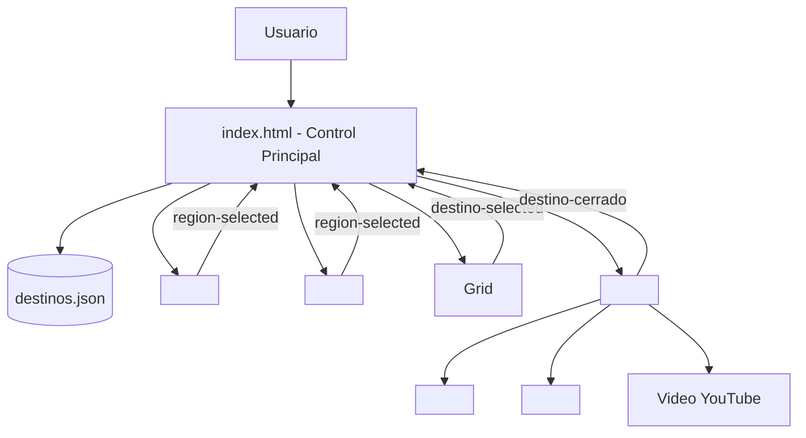

# UNIVERSIDAD DE COSTA RICA
## Sede Regional de Guanacaste • Recinto de Liberia
### Carrera de Informática Empresarial

---

**PROYECTO FINAL**  
# Guía Turística Multimedia de Costa Rica

**Curso**: IF7102 – Multimedios  
**Profesor**: Lic. Alonso Chavarría Cubero  
**Ciclo Lectivo**: I Ciclo 2026  

**Integrantes**:
* Francela Elizondo Granados
* Steven Rodríguez Chacón

**Fecha**: Junio / Julio 2026  

---

# Introducción

La **Guía Turística Multimedia de Costa Rica** es una aplicación web interactiva desarrollada como proyecto final del curso IF7102 – Multimedios de la Universidad de Costa Rica. El sistema tiene como propósito brindar a los usuarios una experiencia dinámica para explorar diversos destinos turísticos del país mediante una interfaz moderna, intuitiva y completamente desarrollada utilizando tecnologías web nativas.

La aplicación fue implementada empleando HTML5, CSS3 y JavaScript ES6+, haciendo uso de la API nativa de **Web Components** para construir una arquitectura modular basada en componentes reutilizables. Cada componente fue desarrollado de forma independiente utilizando **Shadow DOM** para encapsular su estructura y estilos, permitiendo una mejor organización del código y facilitando el mantenimiento de la aplicación.

La información de los destinos turísticos se almacena en un archivo JSON (`destinos.json`) que es cargado dinámicamente mediante la Fetch API. Cada destino presenta información descriptiva, fotografías de portada, galerías interactivas, actividades recomendadas, coordenadas geográficas y enlaces a videos informativos. Además, el sistema incorpora un mapa vectorial interactivo de los 265 cantones de Costa Rica y una guía turística mediante síntesis de voz utilizando la API Web Speech del navegador.

Durante el desarrollo del proyecto también se aplicaron principios de diseño responsivo, experiencia de usuario (UX) estilo "Pura Vida", modo oscuro tropical nocturno y comunicación entre componentes mediante Custom Events, logrando una aplicación organizada, escalable y alineada con los objetivos académicos del curso.

---

# Objetivos del Proyecto

## Objetivo General
Desarrollar una aplicación web multimedia interactiva que permita explorar diferentes destinos turísticos de Costa Rica mediante el uso de tecnologías web nativas, implementando una arquitectura basada en Web Components reutilizables e integrando recursos multimedia para ofrecer una experiencia de usuario atractiva, dinámica y accesible.

## Objetivos Específicos
* Implementar una interfaz web utilizando HTML5, CSS3 y JavaScript ES6+ sin el uso de frameworks externos.
* Aplicar la tecnología de Web Components para construir componentes reutilizables y encapsulados mediante Shadow DOM.
* Incorporar una representación cartográfica vectorial interactiva de Costa Rica dividida por cantones y regiones turísticas.
* Gestionar la información de los destinos turísticos utilizando un archivo JSON cargado dinámicamente mediante la Fetch API.
* Integrar recursos multimedia como imágenes, galerías fotográficas, narración por síntesis de voz y enlaces a videos turísticos para enriquecer la experiencia del usuario.
* Implementar comunicación entre componentes utilizando Custom Events para mantener una arquitectura modular y desacoplada.
* Desarrollar una interfaz responsiva y accesible (`prefers-reduced-motion`) que permita utilizar la aplicación correctamente en diferentes dispositivos.

---

# Descripción General del Proyecto

La Guía Turística Multimedia de Costa Rica es una aplicación web diseñada para facilitar la exploración de algunos de los principales destinos turísticos del país. El sistema organiza la información en cuatro regiones turísticas principales: **Guanacaste (Pacífico Norte)**, **Caribe**, **Valle Central** y **Pacífico Sur (Pacífico Central y Sur)**, permitiendo al usuario consultar información relevante de cada una mediante una interfaz intuitiva y visualmente atractiva.

El usuario puede seleccionar la región que desea explorar a través de la barra de navegación superior o mediante el mapa vectorial interactivo de Costa Rica. Al seleccionar una región, el sistema actualiza de manera instantánea el catálogo de tarjetas turísticas en pantalla.

Cada destino turístico incluye una descripción detallada, una imagen principal de portada, una galería interactiva de fotografías, una lista de actividades destacadas, coordenadas geográficas y un enlace a un video informativo. Además, la aplicación incorpora una guía turística mediante síntesis de voz utilizando la API Web Speech del navegador, permitiendo escuchar la descripción del destino seleccionado sin necesidad de archivos de audio pregrabados.

Toda la información mostrada por la aplicación se obtiene dinámicamente desde un archivo en formato JSON, evitando que los datos se encuentren escritos directamente en el código HTML. La arquitectura del sistema se basa en 6 Web Components nativos, donde cada uno posee responsabilidades específicas y se comunica mediante Custom Events.

---

# Arquitectura del Sistema

La arquitectura de la Guía Turística Multimedia de Costa Rica fue diseñada bajo un enfoque modular utilizando la API nativa de Web Components. Este enfoque permitió dividir la aplicación en componentes independientes, reutilizables y desacoplados.

El archivo `index.html` actúa como controlador principal de la aplicación. Su función consiste en cargar la información almacenada en el archivo `destinos.json`, registrar los componentes personalizados y coordinar la comunicación entre ellos mediante eventos personalizados (Custom Events).

---

# Descripción de los Web Components

A continuación, se describe el funcionamiento de cada uno de los **6 componentes personalizados** desarrollados en el proyecto:

## 1. Componente `<app-header>`
Representa la barra de navegación principal de la aplicación. Muestra el logo "Costa Rica Pura Vida", el menú de regiones y el botón para alternar entre el Modo Claro y Modo Oscuro.

* **Atributos Observados**: `active-region`.
* **Eventos Emitidos**: `region-selected`.

| Método | Función |
| :--- | :--- |
| `render()` | Construye la interfaz del componente. |
| `updateTheme()` | Actualiza los colores y variables CSS según la región activa. |
| `updateActiveButton()` | Resalta el botón de la región activa sin re-renderizar el DOM. |
| `toggleDarkMode()` | Conmuta el tema claro/oscuro y lo persiste en `localStorage`. |

---

## 2. Componente `<mapa-costa-rica>`
Representa cartográficamente el mapa real de Costa Rica utilizando vectores SVG de los 265 cantones agrupados en las 4 regiones turísticas. Incorpora efectos de iluminación ambiental fluida en el fondo.

* **Atributos Observados**: `active-region`.
* **Eventos Emitidos**: `region-selected`.

| Método | Función |
| :--- | :--- |
| `render()` | Genera la estructura vectorial SVG del mapa y la leyenda interactiva. |
| `actualizarRegionActiva()` | Actualiza el resplandor ambiental y resalta los cantones de la región seleccionada. |
| `seleccionarRegion()` | Emite el evento `region-selected` al hacer clic en una zona geográfica. |

---

## 3. Componente `<destino-card>`
Representa visualmente cada uno de los destinos turísticos disponibles en el catálogo mediante una tarjeta resumen con imagen de portada, badge de región y botón de exploración.

* **Atributos Observados**: `destino-id`, `nombre`, `imagen`, `region`, `descripcion`.
* **Eventos Emitidos**: `destino-selected`.

| Método | Función |
| :--- | :--- |
| `render()` | Genera la estructura visual de la tarjeta. |
| `setDestino()` | Asigna la información del destino al componente. |
| `handleCardClick()` | Gestiona la selección del destino y emite el evento correspondiente. |

---

## 4. Componente `<destino-detalle>`
Constituye la ventana modal informativa que despliega la vista completa de un destino. Integra la galería fotográfica, descripción, actividades, coordenadas y reproductor de audio-guía.

* **Atributos Observados**: `destino-id`, `visible`, `region`.
* **Eventos Emitidos**: `destino-cerrado`.

| Método | Función |
| :--- | :--- |
| `render()` | Construye completamente la interfaz del modal. |
| `setDestino()` | Recibe el objeto completo del destino seleccionado y actualiza la vista. |
| `cerrar()` | Oculta el modal y emite el evento `destino-cerrado`. |

---

## 5. Componente `<galeria-imagenes>`
Proporciona una galería fotográfica interactiva en formato carrusel dentro del modal de detalle.

* **Atributos Observados**: `imagenes` (arreglo JSON serializado), `titulo`.

| Método | Función |
| :--- | :--- |
| `render()` | Construye la estructura completa de la galería. |
| `nextImage()` | Avanza a la siguiente fotografía. |
| `previousImage()` | Regresa a la fotografía anterior. |

---

## 6. Componente `<audio-guia>`
Proporciona una experiencia accesible mediante la utilización de la API Web Speech del navegador (`SpeechSynthesis`), convirtiendo la descripción textual en una narración hablada en español.

* **Atributos Observados**: `src`, `texto`, `titulo`, `descripcion`, `region`.

| Método | Función |
| :--- | :--- |
| `render()` | Construye los controles de reproducción. |
| `play()` | Inicia la narración por voz. |
| `stop()` | Detiene la narración activa. |

---

# Comunicación entre Componentes (Custom Events)

El sistema utiliza Custom Events para mantener un bajo acoplamiento. Todos los eventos se emiten con `bubbles: true` y `composed: true` para atravesar el Shadow DOM:

1. **`region-selected`**: Emitido por `<app-header>` y `<mapa-costa-rica>` cuando el usuario cambia de región. El controlador `index.html` filtra las tarjetas.
2. **`destino-selected`**: Emitido por `<destino-card>` al hacer clic en un destino. Carga los datos en `<destino-detalle>`.
3. **`destino-cerrado`**: Emitido por `<destino-detalle>` al cerrar el modal informativo.

---

# Conclusiones

El desarrollo de la Guía Turística Multimedia de Costa Rica demostró la factibilidad de construir aplicaciones web modernas, robustas, responsivas y altamente atractivas utilizando **exclusivamente tecnologías nativas del navegador**, cumpliendo al 100% con los requerimientos académicos del curso IF7102 – Multimedios.
